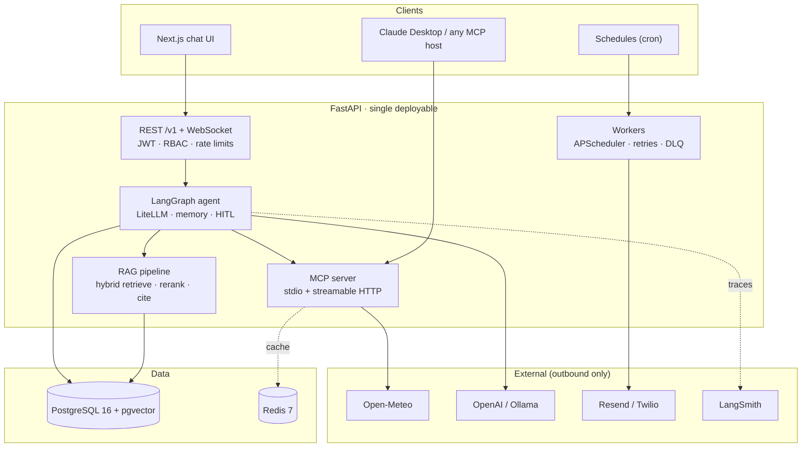

# Weather MCP Platform

**Agentic weather intelligence, built production-first.** Weather data exposed as [MCP](https://modelcontextprotocol.io) tools, orchestrated by a LangGraph agent with persistent memory, grounded by citation-aware RAG over disaster-management documents — with automated reports, severe-weather alerts, and published eval numbers gating every release.

<!-- CI badge activates once .github/workflows/ci.yml lands (Week 0) -->


## Why this project

Most GenAI demos stop at "it answers questions." This one is built solo, to production standards, and every claim below has a testable definition of done:

- **MCP-native** — five typed weather tools + resources + prompts, served over stdio _and_ streamable HTTP; plugs into Claude Desktop or any MCP host
- **Agentic** — LangGraph planning agent with per-user persistent memory, token streaming, human-in-the-loop on outbound actions, and a per-request cost ledger
- **Grounded** — hybrid retrieval (BM25 + pgvector, RRF-fused, cross-encoder reranked) over 20+ disaster/climate documents; every corpus-derived claim carries a citation, and empty retrieval means "the corpus has no answer" — never fabrication
- **Evaluated** — a frozen golden dataset and RAGAS-style quality gates wired into CI; releases are blocked if faithfulness or retrieval quality regresses
- **Operated** — HTTPS deployment with tracing, metrics, uptime monitoring, retries, and dead-letter queues; numbers, not vibes

## Architecture (target)



Full component rationale, data model, and non-functional targets live in [`docs/PRD.md`](docs/PRD.md).

## MCP tools (ship in v0.1)

| Tool                  | Returns                                                              |
| --------------------- | -------------------------------------------------------------------- |
| `get_current_weather` | temp, feels-like, humidity, wind speed/direction, condition          |
| `get_forecast`        | 1–7 day forecast: min/max, precipitation probability, sunrise/sunset |
| `get_air_quality`     | AQI (US + EU), PM2.5, PM10, O₃, NO₂, category + health advice        |
| `get_uv_index`        | current + daily max UV, category, safe exposure minutes              |
| `get_weather_alerts`  | active alerts: type, severity, onset, expiry, area, source           |

Shared conventions: location as `{city}` **or** `{lat, lon}`; metric/imperial units; structured errors (`INVALID_INPUT`, `LOCATION_NOT_FOUND`, `UPSTREAM_UNAVAILABLE`, `RATE_LIMITED`); Redis-cached with per-tool TTLs. Weather data from [Open-Meteo](https://open-meteo.com) (free, keyless).

## Tech stack — and why

| Layer          | Choice                                  | Why                                                       |
| -------------- | --------------------------------------- | --------------------------------------------------------- |
| API            | FastAPI (async)                         | typed, async-native, OpenAPI docs for free                |
| Database       | PostgreSQL 16 + pgvector                | one store for relational + vectors + full-text (BM25)     |
| Cache / queues | Redis 7                                 | response cache, semantic cache, rate limits, pub/sub      |
| Agent runtime  | LangGraph                               | explicit state graphs; checkpointing gives durable memory |
| LLM gateway    | LiteLLM                                 | OpenAI default, local Ollama fallback — swap via env      |
| MCP            | official Python SDK                     | stdio for Claude Desktop, streamable HTTP for the web     |
| Evals          | RAGAS / DeepEval                        | spiking both, keeping one (decision D-03)                 |
| Observability  | LangSmith + OpenTelemetry               | LLM traces + infra spans, separately cheap                |
| Jobs           | APScheduler + SQLAlchemy store          | survives restarts; no Celery needed at this scale         |
| Deploy         | Docker Compose + Caddy + GitHub Actions | single VPS, automatic HTTPS, CD on tag                    |
| UI             | Next.js + Tailwind                      | existing skills; hard one-week timebox                    |

## Quickstart

> The standing promise from v0.1 onward: **clean machine → running MCP server in ≤ 10 minutes.** Until then, this brings up the current state.

```bash
# Prerequisites: Python 3.12, uv, Docker
git clone https://github.com/AbhishekRaj0037/weather-mcp-platform.git
cd Weather-MCP-Server
cp .env.example .env      # config is env-only, app fails fast on missing keys
docker compose up -d      # Postgres 16 (+pgvector) and Redis 7
uv sync
uv run pytest             # same suite CI runs
```

### Connect to Claude Desktop (from v0.1)

Add the server to `claude_desktop_config.json` and the five tools appear in any conversation:

```json
{
  "mcpServers": {
    "weather": {
      "command": "uv",
      "args": [
        "run",
        "--directory",
        "/absolute/path/to/weather-mcp-platform",
        "weather-mcp-server"
      ]
    }
  }
}
```

## Docs

- [`docs/PRD.md`](docs/PRD.md) — requirements & architecture spec v1.0: functional requirements with acceptance criteria, NFRs, tool contracts, data model, risks, open decisions
- Version acceptance gates and the 26-week execution cadence live in the PRD's companion weekly plan — this repo ships against it publicly

## Author

**Abhishek Raj** — Python backend / GenAI engineer. Building this in public, Jul–Dec 2026.
[GitHub](https://github.com/AbhishekRaj0037) · [LinkedIn](https://www.linkedin.com/in/abhishek-raj-365b5b202)

## License

[MIT](LICENSE)
